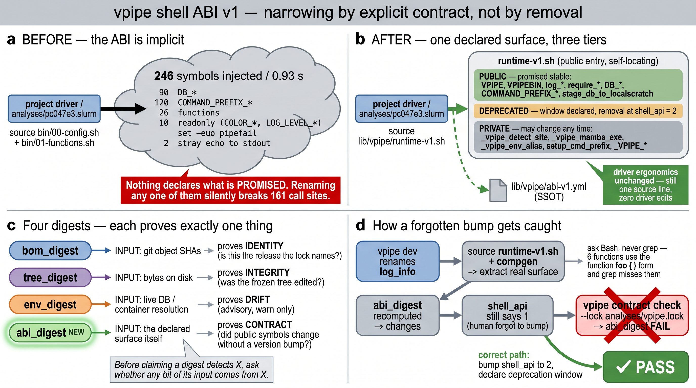

# vpipe shell ABI v1 — 阶段 E 终态设计(预览稿)

> **状态**:设计预览,**尚未实现**,等待裁定。
> **上游**:[bash-nextflow-integration-plan.md](bash-nextflow-integration-plan.md) §3-L3 / §7-E。
> **同族规范**:[vpipe-lock-format-v1.md](vpipe-lock-format-v1.md)(消费侧 lock 格式)、
> [vpipe/docs/VERSION_CONTRACT.md](file:///home/allen/vpipe/docs/VERSION_CONTRACT.md)(生产侧契约面)。
> **接手文档**:[HANDOFF-2026-07-21-qproj-phase-E.md](file:///home/allen/.configure/docs/HANDOFF-2026-07-21-qproj-phase-E.md);
> **操作手册**:[BEST-PRACTICE-vpipe-pin.md](file:///home/allen/.configure/docs/BEST-PRACTICE-vpipe-pin.md)。



---

## 0. 一句话

**ABI 收窄 ≠ 少注入符号,而是「明确承诺哪些不会变」并让这份承诺进 digest。**
driver 的写法一字不改(仍是一行 `source`),变的是:vpipe 第一次**书面声明**了哪些符号是契约、
哪些是实现细节,且「改了契约却没 bump 版本」会被 `vpipe contract check` 红灯拦住。

---

## 1. 为什么不是「lean 模式」(否决记录)

初版设计想让 driver 不再 source [bin/00-config.sh](file:///home/allen/vpipe/bin/00-config.sh),
改用 `vpipe_db` / `vpipe_cmd` 懒解析函数。**否决**,理由三条:

1. **核心目标一条都不需要它。** 让 `shell_api` 有实质内容、让忘 bump 被抓、给项目稳定接口、
   让「用了 private」可检测 —— 全部可在保留 `source` 的前提下达成。lean 只多买到 0.93 s → 0.02 s,
   那是次要收益。
2. **它没解决真正的问题。** 真正的风险不是「driver 能看见 90 个 `DB_*`」,而是
   **「没人知道哪个项目依赖了哪个符号」**。lean 靠**剥夺可见性**解决,linter 靠**建立可见性**解决;
   后者才是 §7-F fleet 治理的方向,前者是把债务藏起来。
3. **public surface 不该从零设计,应由既成事实决定。** 161 个 `log_info` 调用点意味着 `log_info`
   **事实上已经是 public API**。把它标 private 再要求全体迁移,是把工程债包装成整洁。

保留的唯一窄形态:`VPIPE_ABI_DECLARE_ONLY=1` —— 只声明不实现,**唯一消费者是 BOM 提取器**
(surface 清单是纯静态的,不该为读它付 0.93 s + 依赖 micromamba / python3 / tools.yml)。

---

## 2. 现状实测(2026-07-21,spark1)

一次 `source 00-config.sh + 01-functions.sh` 的实际注入(用 `compgen` 前后差集测得,**非 grep**):

| 类别 | 数量 | 备注 |
|---|---|---|
| `DB_*` | 90 | 由 [bin/yaml_to_env.sh](file:///home/allen/vpipe/bin/yaml_to_env.sh) 从 [conf/database.yml](file:///home/allen/vpipe/conf/database.yml) 生成 |
| `COMMAND_PREFIX_*` | 120 | 由 `setup_cmd_prefix()` × [conf/tools.yml](file:///home/allen/vpipe/conf/tools.yml) 生成 |
| 函数 | 26 | 见 §2.1 分解 |
| `readonly` | 10 | `COLOR_*` × 6、`LOG_LEVEL_*` × 4 —— **不可 unset,会污染 caller** |
| 其它变量 | ~20 | `VPIPE`、`VPIPEBIN`、`DBPATH`、`IPR_VERSION`、`VPIPE_LOG_LEVEL`… |
| 副作用 | — | `set -euo pipefail`、`export TMPDIR`、**2 处 `echo` 到 stdout** |
| **耗时** | **0.93 s** | 其中 ~0.75 s = `setup_cmd_prefix` 被 eval 调用 ~120 次的 env probe |

拆解耗时(用以排除误判):`python3` 启动 0.016 s、`yaml_to_env.sh` 两次共 0.09 s、
`micromamba env list` 单次 0.02 s —— 都不是瓶颈,瓶颈是 120 次 probe 里的 `$(pwd)` / `command -v` fork。

### 2.1 26 个函数的真实分解(grep 会漏)

| 组 | 数量 | 成员 |
|---|---|---|
| 日志 | 7 | `log_debug/info/success/warn/error/start/end` |
| 断言 | 5 | `require_file/dir/db/var/command` |
| 生命周期 | 2 | `cleanup_on_exit`、`setup_cleanup_trap` |
| 数据搬运 | 2 | `stage_db_to_localscratch`、`get_files_for_task` |
| **工具专用包装** | **6** | `mgv_cluster_aai/ani`、`run_virsorter2`、`run_deepvirfinder`、`run_mmseqs2taxonomy`、`parse_mmseqs2taxonomy` |
| 站点私有 | 3 | `_vpipe_detect_site`、`_vpipe_mamba_exe`、`_vpipe_env_alias` |
| 容器机制 | 1 | `setup_cmd_prefix` |

> ⚠ **那 6 个工具专用包装用 `function foo {` 语法定义**([bin/01-functions.sh:290](file:///home/allen/vpipe/bin/01-functions.sh) 起),
> 我第一版 `grep '^[a-z_]*()'` **全部漏掉**。这与 VERSION_CONTRACT §2「被测物是 Bash 脚本,那就去问 Bash」
> 完全同构 —— **surface 提取必须 `source` + `compgen`,绝不能 grep**。这条写进实现约束。

### 2.2 顺带查出的两类既存问题(E 的 linter 立刻有战果)

**(a) 逃出 `DB_*` 命名约定的数据库变量** —— [conf/database.yml](file:///home/allen/vpipe/conf/database.yml)
有两套写法:短键(`pvog:` → `DB_PVOG`)与全大写显式键(`EGGNOG_DB:`、`HVPC_DB:`、`DESC_PVOG:` → 原样注入)。
故 `DB_*` 前缀**不等于**「全部数据库变量」,至少 10 个在前缀之外:
`DESC_DBAPIS`、`DESC_DEFENSEMERGE`、`DESC_PVOG`、`DESC_VOGDB`、`EGGNOG_DB`、`HVPC_DB`、`HVPC_ANNO`、
`KEGG_DB_DIR`、`KEGG_GENE2KO`、`KEGG_KO2PATHWAY`。清单必须逐名枚举,不能靠前缀通配。

**(b) 21 个被引用但未注入的 `DB_*` + 7 个 `COMMAND_PREFIX_*` 候选**
(`DB_HVPC`、`DB_MASH`、`DB_SYLPH`、`DB_CENTRIFUGER`、`DB_TAXMYPHAGE`、`COMMAND_PREFIX_MMSEQS`…)。
> ⚠ **这是候选不是结论。** 其中相当一部分是脚本**局部变量**(`DB_TARGET`、`DB_PREFIX`、`DB_DIR`、
> `DB_VAR`、`DB_CUSTOM`、`DB_MMSEQS2_` 明显是拼接前缀,`COMMAND_PREFIX_FOO` 是示例)。
> 逐个区分「局部变量」与「真 dangling」正是 `vpipe abi check` 的第一个用途 —— **不预先断言**
> (`EL-021` 的教训:判据本身失效时,越自信越危险)。

**(c) `00-config.sh` 的 stdout 污染** — [00-config.sh:8-9](file:///home/allen/vpipe/bin/00-config.sh)
`echo "Number of threads: ..."` / `echo "Memory per node: ..."`,末行 `echo "vpipe site: ..."`。
任何 `X=$(source 00-config.sh; ...)` 都会被污染。runtime-v1.sh 可在**不改 private 文件**的前提下修掉
(source 时重定向 stdout→stderr),这是 public 层的第一个实质增值。

---

## 3. 终态:文件布局

### 3.1 vpipe 侧新增([~/vpipe/](file:///home/allen/vpipe/))

```
lib/vpipe/
├── runtime-v1.sh      # ★ public shell 入口。项目 driver 唯一该 source 的东西
└── abi-v1.yml         # ★ SSOT:三档符号清单 + shell_api / nf_api / python_api

conf/public/
├── labels-v1.config   # process label 资源契约(include 现有 conf/base.config,不重构它)
└── params-v1.config   # 项目可覆盖的 params 契约面
```

- [bin/00-config.sh](file:///home/allen/vpipe/bin/00-config.sh) 与
  [bin/01-functions.sh](file:///home/allen/vpipe/bin/01-functions.sh) **一字不改**,
  降级为 *private implementation*(仅文档地位变化,54 个内部脚本继续直接 source 它们)。
- [conf/base.config](file:///home/allen/vpipe/conf/base.config) /
  [nextflow.config](file:///home/allen/vpipe/nextflow.config) **不动**;
  `conf/public/*.config` 是新增的 versioned 入口层。

### 3.2 vpipe 侧改动

| 文件 | 改什么 |
|---|---|
| [core/bom.py](file:///home/allen/vpipe/pkgs/vpipe/src/vpipe/core/bom.py) | tier-3 从硬编码 `{1,1,1}` → 真实提取;新增 tier-4 + `abi_digest` |
| [cli/contract.py](file:///home/allen/vpipe/pkgs/vpipe/src/vpipe/cli/contract.py) | 新增 `abi_digest` 检查(`_check_api` 从「比三个整数」升级为「比 surface 内容」) |
| `cli/abi.py`(新) | `vpipe abi show` / `vpipe abi check <script>` — 静态扫描 driver,报 public / private / unknown 用量 |
| [docs/INVARIANTS.md](file:///home/allen/vpipe/docs/INVARIANTS.md) | `INV-SH-01` 更新(项目 driver source public 入口)+ 新 `INV-SH-09`(surface 变更须 bump + deprecation window) |
| [docs/VERSION_CONTRACT.md](file:///home/allen/vpipe/docs/VERSION_CONTRACT.md) | §2 加 tier-4 与第四个 digest;§5 诚实边界删掉「三个 `*_api` 无实质内容」那条 |

### 3.3 qproj 侧改动

| 文件 | 改什么 |
|---|---|
| [R/vpipe_lock.R](../R/vpipe_lock.R) | `proj_vpipe_pin` 写入 `abi_digest`;`proj_vpipe_check` 报告它 |
| [dev/vpipe-lock-format-v1.md](vpipe-lock-format-v1.md) | lock 格式加 `abi_digest` 字段(`lock_version` 是否 bump 见 §6) |
| [tests/testthat/test-vpipe_lock.R](../tests/testthat/test-vpipe_lock.R) | 新字段的 round-trip 断言 |
| [inst/scripts/qproj.sh](../inst/scripts/qproj.sh) | **不改** — bash resolver 只读 `release_path` 等 4 个键,`abi_digest` 由 Python 侧校验 |

### 3.4 试点侧(pc047e3)

| 文件 | 改什么 |
|---|---|
| [analyses/pc047e3.slurm](../../pc047e3-HpyloriTcell/analyses/pc047e3.slurm) | **仅 2 行**:两条 `source .../bin/0*.sh` → 一条 `source "${VPIPE_ROOT}/lib/vpipe/runtime-v1.sh"` |
| [analyses/vpipe.lock](../../pc047e3-HpyloriTcell/analyses/vpipe.lock) | 重新 pin 到 `v0.10.0`,自动获得 `abi_digest` |

其余 429 行 driver(`require_file` × 10、`log_start`/`log_end`、`$COMMAND_PREFIX_MEGAHIT`)**一字不改** ——
它们全部落在 public 档内。

---

## 4. 核心机制一:三档清单 `abi-v1.yml`

```yaml
# lib/vpipe/abi-v1.yml — vpipe shell ABI 的 SSOT
shell_api: 1

public:            # 承诺不变。改名 / 改语义 = 必须 bump shell_api
  variables:
    - VPIPE
    - VPIPEBIN
    - DBPATH
    - {pattern: "DB_*", enumerated: [DB_VPF, DB_CHECKV, ...]}   # 逐名枚举,§2.2(a)
    - {pattern: "COMMAND_PREFIX_*", enumerated: [...]}
    - [EGGNOG_DB, HVPC_DB, HVPC_ANNO, KEGG_DB_DIR, ...]         # 逃出前缀的那 10 个
  functions:
    - [log_debug, log_info, log_success, log_warn, log_error, log_start, log_end]
    - [require_file, require_dir, require_db, require_var, require_command]
    - [stage_db_to_localscratch, get_files_for_task]
    - [cleanup_on_exit, setup_cleanup_trap]

deprecated:        # 有窗口期。linter 报告谁还在用;到期在 shell_api=2 移除
  functions:
    - {name: mgv_cluster_aai,  since: "0.10.0", remove_at: "shell_api=2",
       reason: "工具专用包装混进通用 toolkit;应下沉进调用它的 .slurm"}
    - {name: run_virsorter2, ...}      # §2.1 那 6 个
  variables:
    - {name: IPR_VERSION, since: "0.10.0", reason: "单工具版本常量,不属通用 surface"}

private:           # 随时可改,不进 digest,不承诺任何事
  functions: [_vpipe_detect_site, _vpipe_mamba_exe, _vpipe_env_alias, setup_cmd_prefix]
  variables: [_VPIPE_CONF_DIR, _VPIPE_TIME_DIR]
  readonly: [COLOR_*, LOG_LEVEL_*]     # 实现细节;readonly 无法 unset 是既成事实,如实记录
```

**提取与自检**(实现约束,来自 §2.1 的教训):
`runtime-v1.sh` 在 `VPIPE_ABI_DECLARE_ONLY=1` 下只读 yml;正常模式下 source private 后
用 `compgen -A function` / `compgen -v` 拿**真实**符号表,与 yml 对账:

- yml 声明了但实际不存在 → **hard fail**(清单撒谎)
- 实际存在但 yml 未分类 → **warn + 计数**(新增符号忘了归档)

这条自检本身就是「记录了却从不校验的字段 = 假保证」(`EL-020`)的解药。

---

## 5. 核心机制二:第四个 digest

### 5.1 为什么现在的 `shell_api: 1` 是假的

[core/bom.py:444](file:///home/allen/vpipe/pkgs/vpipe/src/vpipe/core/bom.py) 目前是
`"tier3": {"shell_api": 1, "nf_api": 1, "python_api": 1}` —— **硬编码常数**。
它进 `bom_digest`,但**输入里没有一位来自真实的 public surface**,所以
[cli/contract.py:244](file:///home/allen/vpipe/pkgs/vpipe/src/vpipe/cli/contract.py) 的
`api_versions` 检查**检测不到任何 ABI 变化**。

这与 `EL-015`(`bom_digest` 不读磁盘就查不出磁盘被改)**完全同构**,也是同一条规则的第二次应用:

> **声称某个 digest 能检测 X 之前,先问它的输入里有没有一位来自 X。**

### 5.2 四个 digest 的分工

| digest | 输入 | 证明 | 不匹配 |
|---|---|---|---|
| `bom_digest` | git object SHA | **身份** — lock 是否指向这个 release | fail |
| `tree_digest` | 磁盘字节 | **完整性** — 物化后被改过吗 | fail |
| `env_digest` | 活 DB / 容器解析结果 | **漂移** — 环境变了吗 | warn(`--strict` 才 fail) |
| **`abi_digest`** 🆕 | **声明的 surface 本身** | **契约面** — public 符号变了却没 bump 吗 | fail |

### 5.3 兼容性设计(★ 关键取舍)

**tier-3 保持只有三个整数不变 → `bom_digest` 的输入不变 → 所有已有 lock 继续有效。**
surface 详情放**新增的 tier-4**,单独算 `abi_digest`。

这不是为了省事,而是语义正确:`bom_digest` 答「你是不是我 pin 的那个」,
`abi_digest` 答「你声称的 API 版本对应的实际内容变了吗」。**恰恰因为 `shell_api` 是人手 bump 的,
才需要一个由机器算的 digest 来抓「忘了 bump」** —— 若把 surface 塞进 `bom_digest`,
它会与 commit 身份混在一起,反而说不清红灯是因为换了 release 还是改了 ABI。

---

## 6. 端到端数据流

```
vpipe 开发者改了 public 符号
        │
        ├─ 正确路径:bump shell_api → 1→2,deprecated 档写窗口期 → 打 tag v0.11.0
        │
        └─ 遗漏路径:忘了 bump
                │
   vpipe bom generate   ← source runtime-v1.sh(DECLARE_ONLY)+ compgen 提取真实 surface
                │
        abi_digest 变了,shell_api 仍是 1
                │
   项目侧 vpipe contract check --lock analyses/vpipe.lock
                │
        abi_digest FAIL ── 「release 的 public surface 与本 lock 记录的不一致;
                            要么 vpipe 忘了 bump shell_api,要么请重新 pin」
```

`qproj::proj_vpipe_pin()`([R/vpipe_lock.R](../R/vpipe_lock.R))在写 lock 时把 `abi_digest`
一并记下,与现有三个 digest 并列。

---

## 7. 验收判据(每条都要有实证,不接受声称)

| # | 判据 | 怎么验 |
|---|---|---|
| 1 | 清单不撒谎 | yml 里每个 public 符号,`source` 后 `compgen` 真的能找到;故意删一个 → 提取器 hard fail |
| 2 | **`abi_digest` 真的能抓到改动** | 往 pinned release 的 `01-functions.sh` 加一个 public 函数 → `contract check` 报 `abi_digest` FAIL(**负对照**:改一个 private 函数 → 不报) |
| 3 | 旧 lock 不被误伤 | pc047e3 的 `v0.9.1` lock 在装了新 vpipe 后 `contract check` 仍全绿(除 `abi_digest` 报「本 lock 早于该字段」warn) |
| 4 | driver 零回归 | pc047e3 改 2 行后,`bash -n` + `shellcheck` 无新增 warning;**真 sbatch 到 spark2** rc=0,`$VPIPE` == `$VPIPE_ROOT` |
| 5 | linter 有战果 | `vpipe abi check analyses/pc047e3.slurm` 报出它用的 public 符号清单;对 §2.2(b) 的 28 个候选给出分类 |
| 6 | nf surface 结构性成立 | `nextflow config -flat` 在 include `conf/public/labels-v1.config` 前后,label 定义逐字一致 |
| 7 | stdout 不再被污染 | `X=$(source runtime-v1.sh && echo ok)` → `X` 恰好是 `ok` |

---

## 8. 诚实边界(完成后如实声称)

- **面积当下不缩小。** 本方案把 246 个符号**变成显式承诺**,不是移除它们。真正的收缩靠
  `deprecated` 档 + linter 报告渐进推进,窗口期到了才在 `shell_api=2` 移除。
  **声称「收窄了 ABI」是不诚实的;应说「ABI 从此有了书面定义与机器校验」。**
- **`conf/public/*.config` 零端到端消费者。** 目前没有任何项目 `.nf`
  (pc047e3 是纯 shell driver),故 nf surface 只有结构性验证(判据 6),
  **没有**「项目真的 include 了它并跑通」这一层证据。
- **`abi_digest` 只覆盖 shell 与 nf 的声明面。** `python_api` 仍是裸整数 —— Python CLI 的
  public surface(`vpipe <noun> <verb>` 命令集)需要另一套提取机制(`click` 内省),不在 E 范围。
- **linter 是静态的。** `vpipe abi check` 扫不到 `eval` / 间接变量引用 / 动态构造的符号名。
- **`readonly` 污染无解。** `COLOR_*` / `LOG_LEVEL_*` 一旦 source 就无法 unset,
  这是 Bash 的性质,清单只能如实记录它,不能消除它。
- 三条既有边界不变:数据库与容器镜像仍未 pin、容器默认指纹弱于哈希、
  `vpipe bom prune` 不知道哪些项目在用某 release(见
  [BEST-PRACTICE §8](file:///home/allen/.configure/docs/BEST-PRACTICE-vpipe-pin.md))。

---

## 9. 工作量与顺序

| 步 | 内容 | 依赖 |
|---|---|---|
| E-1 | `abi-v1.yml` 清单 + `runtime-v1.sh` + 对账自检 + pytest | — |
| E-2 | `bom.py` tier-4 + `abi_digest`;`contract.py` 新检查 | E-1 |
| E-3 | `conf/public/*.config`(最小声明版)+ nf surface 提取 | E-1 |
| E-4 | `vpipe abi show / check` linter | E-1 |
| E-5 | qproj 侧 lock 字段 + R 测试 + 格式规范更新 | E-2 |
| E-6 | 文档:`INV-SH-01/09`、VERSION_CONTRACT §2/§5 | E-2,E-3 |
| E-7 | 试点 pc047e3 改 2 行 + tag `v0.10.0` + 重新 pin + **sbatch 验收** | 全部 |

E-1/E-2 是关键路径;E-3/E-4 可与之并行。
